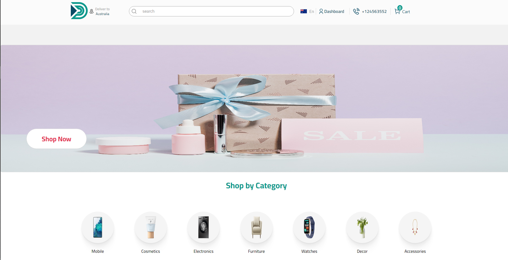

# [Preview Site](https://e-r.netlify.app/)

# E-commerce Store React

Welcome to our React-based E-commerce Store Project! As a web developer, your contributions to this project will be invaluable in creating an online store that offers customers a seamless and enjoyable shopping experience.

Utilizing the React library, we are creating a highly interactive and responsive user interface that provides customers with a smooth and intuitive shopping experience.

Our project utilizes the latest technologies and tools in React to create a modern and efficient online store. We are developing the frontend of the site using React, while utilizing a backend API to handle data storage and management. Our design focuses on creating an aesthetically pleasing user interface that is easy-to-use and provides customers with quick access to the products they are interested in.

As a web developer, you will have the opportunity to contribute to the development of the site and help shape its functionality and design. Our site offers a range of features including product management, user management, order management, secure payment processing, and the ability to display promotions and discounts. We have implemented the latest security protocols to ensure that our customers' data is kept safe and secure.

We will be continuously updating and improving the site to ensure that we are providing the best possible experience for our customers. Thank you for your interest in our React-based E-commerce Store Project, and we look forward to collaborating with you to deliver a top-notch online shopping experience.

# History of updates

# 8/6/2023 create project and start development

# 10/6/2023 90 footer completed & backend api strapi created

- Files on GitHub https://github.com/mohamed404eg/api-ecommercereact

# 11/6/2023 A new account registration page has been created

- The new account registration page API has been prepared from the Back-end and the front-end
- And the footer has been completed

# 12/6/2023 The Second Menu has been created

- Menu Second is for large devices from max-width: 992px
- The data comes from the api [name , href]

## 13/6/2023 Many endpoints are created in the API:

- Brand
- category
- Prodect
- Rating & Review

## 14/6/2023 home page > welcomePhoto don

## 22/6/2023 home page > Special offer

=======

## 14/6/2023 home page > welcomePhoto don

## 19/6/2023 redux installed, react-redux @reduxjs/toolkit:

- Reducer has been configured to configure redux to cart
- Start creating home/FirstCategoty
- Components/products have been worked on

## 22/6/2023 home page > Special offer

## 1/7/2023 Product > ProductDetails

## 2/7/2023 Product > ProductDetails responsive

## 5/7/2023 Product > work in Cart and payment methods

## 5/7/2023 \*

- use alert
  enqueueSnackbar("New account registration succeeded", {
  variant: "success",
  });

## 9/7/2023 The project has been completed

# /_ responsive _/

- max-width: 1024px
- max-width: 992px
- max-width: 728px
- max-width: 600px
- max-width: 480px
- max-width: 426px
- max-width: 320px
-
- min-width: 993px

# var colors

--white: #fbfbfb;
--DarkGray: #a3a3a3;
--InkBlue: #0a4b65;
--border: #d9d9d9;
--white100: #ffffff;
--whiteF2: #F2F2F2;
--whiteFc: #fcfcfc;
--StormyStraitGreen: #0d988c;
--black:#000000;

# enqueueSnackbar (notistack)

variants:

- default
- success
- error
- warning
- info

# Technology Used

- React
- React Router
- HTML
- CSS
- JavaScript
- notistack
- react redux
- react-stripe
- react mui
